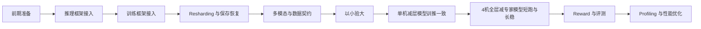
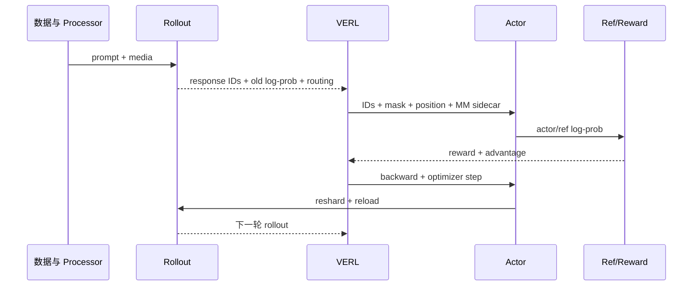
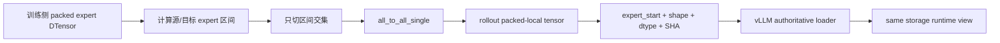
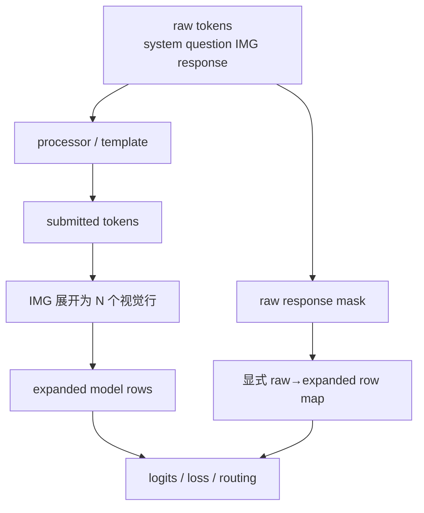
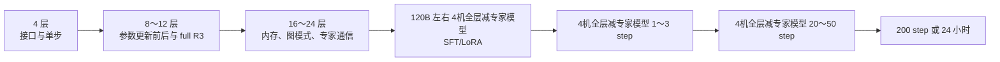
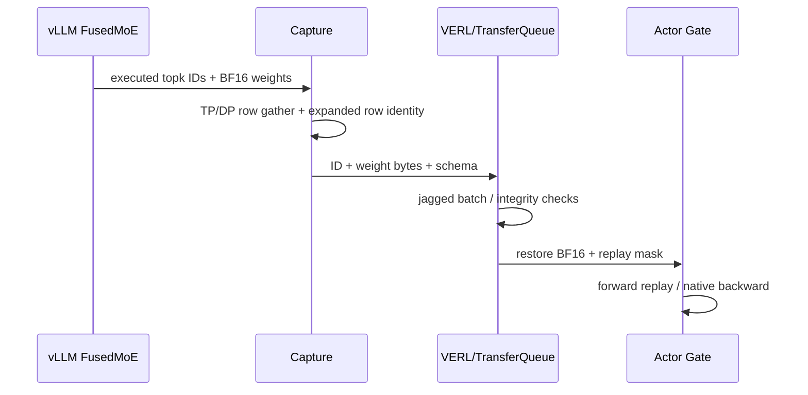

# RL 新模型开箱：Kimi K3 案例

RL 新模型开箱覆盖环境兼容、训练与推理框架接入、权重重分片、多模态数据契约、以小验大、训推一致、长稳效果和性能优化。模型成功加载并生成结果，只说明初始接口层已经连通；前期遗留的问题通常会在 4机长跑中放大，定位成本也随之上升。

本文以 Kimi K3 的实际接入过程为案例，说明每个步骤要完成什么、如何判断可以进入下一步、Kimi K3 遇到过哪些问题，以及其它新模型需要提前检查什么。Kimi K3 是多模态 MoE 模型，包含视觉编码、动态 token 展开、Attention/KDA、专家路由和跨后端在线权重同步。这些结构使开箱同时涉及数据坐标、并行布局、数值语义和参数生命周期。

# 1 整体流程

## 1.1 目标

新模型 RL 开箱需要同时完成高精度、低精度、训练效果、长稳和性能五条工作线。Kimi K3 本轮的目标来自以下两组要求：

1. 打通 Kimi K3 高精度和低精度 RL 流程。先用单机减层模型验证结构和更新链路，再通过专家裁剪、SFT 和 LoRA 得到 4机全层减专家模型；训练过程中 reward 能正常计算并上升，训推一致性不随参数更新持续恶化，下游评测相对基线上涨，任务可以长时间稳定运行。
2. 打通 FSDP-Turbo 的高精度能力，覆盖 EP、CP、PP 及 Kimi K3 的 Attention/KDA 结构；训练侧目标达到 A3 MFU 25%、A5 MFU 30%，并挑战 40%。

| 工作项 | 开箱目标 | 进入下一步前需要确认 |
|---|---|---|
| 高精度 | BF16 下训练、rollout、更新、同步、保存恢复链路完整可用 | 训推一致对齐 |
| 低精度 | 明确量化范围、QAT 状态和训练到 rollout 的格式转换 | 相对 BF16 的精度、显存和吞吐收益可量化 |
| 训练效果 | reward 方向合理，目标评测不退化 | reward正常上升，回答质量提高 |
| 长稳 | 200 step 或 24 小时运行稳定 | 无 NaN、OOM、worker 丢失和持续数值漂移 |
| 性能 | 阶段时延、MFU、吞吐达到项目目标 | 口径固定，优化结果有 A/B 和回退点 |

## 1.2 开箱步骤

新模型开箱按下图推进。功能打通、训推一致和性能优化不能并成一个任务；三者使用的样本、配置和判定方式不同。



| 步骤 | 主要工作 | 本步产物 | 常见失败 |
|---|---|---|---|
| 前期准备 | 锁定三方依赖、模型代码、权重、数据和机器资源 | 环境清单、资源预算 | 环境混用、权重与 config 不配套、容量低估 |
| 推理接入 | 注册模型、加载真实权重、打通文本和多模态生成 | eager 基线、评测与输出样例 | 模型类不匹配、视觉 token 错位、图模式引用旧权重 |
| 训练接入 | 完成 forward、backward、optimizer step 和并行切分 | 训练接入日志、梯度与参数检查 | 重计算冲突、grad norm NaN、FSDP all-gather OOM |
| Resharding | 将训练布局转换为 rollout 布局并在线更新 | 参数映射、指纹、同步耗时 | 全量聚合、专家偏移错误、IPC buffer 被覆盖 |
| 多模态适配 | 对齐 raw token、模型展开行、loss 与路由坐标 | 图像token正常展开替换，logits、label对齐 | 图片展开后 response 位置整体偏移 |
| 以小验大 | 用单机减层模型验证链路，通过专家裁剪和 SFT/LoRA 得到 4机全层减专家模型 | 可训练的单机减层模型和 4机全层减专家模型、简单数据集、同口径专家方案对比 | 模型太大、裁剪后 reward 恒为 0、不同方案口径不一致 |
| 训推一致 | 固定同一输入逐模块比较 | msprobe采集逐层数据、首差异模块 | response 重编码、数学语义不同、路由放大 |
| 4机全层减专家模型长稳 | 1～3 step 短跑、20～50 step、200 step 或 24 小时 | 趋势、checkpoint、评测结果 | 更新后漂移、主机内存不足、奖励误判 |
| 性能优化 | 拆整步、采训练和 rollout profile、单变量优化 | MFU、性能profiling | 关闭offload、recompute后OOM |

## 1.3 时间安排

整体排期使用两套相对时间。第一段是训练、推理和 RL 前置工作的 Day0～Day7，三条工作线并行。训练和推理基础能力完成后，才开始计算独立的 RL Day0～Day28。顺排总跨度约 35 天，不能把前置 Day7 当成全部开箱周期。

| 时间 | 主要安排 | 计划结果 |
|---|---|---|
| 前置 Day0～Day7 | 训练侧 EP/TP/PP、长序列、动态长度和重计算；推理侧 EP/TP/PP、图模式、异步调度、routing replay、chunk prefill 和 BF16；RL 侧核对依赖并用相似模型预跑 | 训练和推理基础能力可用，三方依赖明确 |
| RL Day0～Day2 | 推理框架接入，适配 `skip_rollout` | rollout 能正常输出；不采样时也能检查后续链路 |
| RL Day2～Day4 | 推理核心能力验证，训练后端接入 | 完成一个真实 RL step |
| RL Day2～Day5 | Resharding 开发 | 完成权重切分、转换和分发 |
| RL Day3～Day6 | Routing Replay 接入 | 路由数据能够从 rollout 返回训练侧 |
| RL Day6～Day8 | 推理加载精度、权重保存加载、断点续训和异步保存 | 权重可核对，训练状态可恢复 |
| RL Day8～Day9 | 20～30 step 功能长跑 | 任务无运行错误，reward 能正常计算 |
| RL Day0～Day7 | 单机减层模型、4机全层减专家模型、训前逐模块对齐 | 两类模型均可正常生成，`abs(Δlogp) < 0.01` 作为初始目标 |
| RL Day8～Day10 | VERL 单机减层模型更新前后对齐 | 首次参数更新前，以及第一次参数更新并同步后，训练侧与 rollout 侧的差异均在启动时约定的阈值内 |
| RL Day10～Day11 | CP、seq-pack 等特性逐项叠加 | 每项开启后重新比较训推差异 |
| RL Day11～Day14 | 大模型对齐、200 step 或 24 小时长稳 | reward、评测、稳定性和数值趋势可联合判断 |
| RL Day15～Day28 | 训练、推理和 RL 性能优化 | RL 单步控制在 1 小时内，完成性能收口 |

> 图片生成 prompt：制作一张 21:9 的双层时间轴。第一层为“前置 Day0～Day7”，包含训练、推理、RL 依赖三条并行泳道；Day7 结束处标注“进入 RL Day0”。第二层为“RL Day0～Day28”，依次标出 Day0～6 功能接入、Day2～8 Resharding 与保存恢复、Day0～11 以小验大和精度对齐、Day11～14 长稳与效果、Day15～28 性能优化。顶部增加总跨度“约 35 天”。使用深蓝、青色、绿色和少量琥珀色，信息密度高但文字简洁，无人物、无 logo、无水印。

## 1.4 如何判断开箱已经完成

模型可加载、可完成一步、200 step 无运行错误，分别代表不同层级。新模型开箱至少要分开回答下面的问题：

| 层级 | 回答的问题 | 不能替代的结论 |
|---|---|---|
| 单机减层模型可用 | 训练和推理能否分别加载并执行 | 4机 RL 编排、权重在线更新 |
| 一步闭环 | rollout、old/ref log-prob、reward、backward、optimizer、同步是否连通 | 更新后的训推一致 |
| 参数更新后对齐 | 参数更新后差异是否被放大 | 长时间稳定和训练效果 |
| 20～50 step | 数值趋势、保存恢复是否稳定 | 200 step 或 24 小时运行 |
| 200 step/24 小时 | 是否存在泄漏、累积漂移和系统故障 | reward 设计合理、下游评测上涨 |
| 性能达标 | 训练、rollout、同步是否达到目标 | 其它模型和其它拓扑的线性外推 |

# 2 前期准备

## 2.1 提前获取三方依赖的版本

训练、推理和 VERL 环境通常不会使用同一套 Python 与二进制依赖。新模型接入前应分别采集环境，不要先合并环境再排兼容问题。

Kimi K3 的一组历史环境快照如下。该表用于说明依赖差异的规模，每次复跑仍需重新导出实际版本。

| 栈 | 训练环境 | 推理环境 | VERL 环境 |
|---|---|---|---|
| Python | 3.11.0 | 3.12.13 | 3.11.15 |
| CANN | 9.1.0 | 9.0.1 | 9.0.0 |
| PyTorch | 2.7.1 | 2.10 | 2.7.1 |
| Transformers | 4.56.2 | 5.5.4 | 4.55.2 |
| tokenizers | 0.22.2 | 0.22.2 | 0.21.4 |
| Triton | 3.5 | 3.5 | 未记录 |
| 主要用途 | FSDP/MindSpeed 训练 | vLLM/vLLM-Ascend | Ray + VERL 编排 |

三套环境共统计到 568 个唯一包。只有 17 个版本完全一致，22 个存在小版本差异，53 个跨大版本，476 个只出现在某一个环境。两两比较的结果也说明，包名重叠不能代替核心依赖检查。

| 环境比较 | 重叠包 | 同版 | 小版本差异 | 大版本差异 |
|---|---:|---:|---:|---:|
| 训练 vs 推理 | 112 | 78 | 18 | 16 |
| 训练 vs VERL | 160 | 35 | 46 | 79 |
| 推理 vs VERL | 99 | 18 | 24 | 57 |

每个环境至少采集以下内容：

```bash
python --version
python -m pip list
python -m pip show torch torch-npu transformers tokenizers triton triton-ascend
env | grep ASCEND
```


### 2.1.1 Kimi K3 遇到的问题

1. A3 和 A5 的可用组合不同。A3 使用 Triton-Ascend 3.2.2 和 torch_npu 2.10.0.post2，A5 使用 Triton-Ascend 3.6.0 和 torch_npu 2.10.0.post5。将 A5 可运行的私有 kernel 直接迁移到 A3 后，出现过首步 grad norm NaN。
2. vLLM 与 vLLM-Ascend 升级后，模型实现、processor 协议和 KDA 融合边界发生变化。旧目录中的补丁即使仍在磁盘上，Ray worker 也可能完全没有加载。
3. KDA 依赖的 recurrent、chunk 和 gate-cumsum 算子 schema 需要与 CANN、torch_npu 及构建产物配套。缺少任意 schema 时，任务应在正式启动前失败。

### 2.1.2 注意事项（适用于其它新模型）

- 核心版本优先级高于整体同版率：CANN、驱动、torch、torch_npu、Transformers、tokenizers、Triton 和私有算子需要逐项确认。
- editable 包记录路径、commit 和 diff。仅保存 `pip freeze` 不足以还原源码。
- 三套环境通过 safetensors、JSON、tokenizer、processor 配置和数据文件交换，不共享 `.so`、编译缓存、跨 Python ABI 的 pickle 或整个 site-packages。
- 升级推理框架后，重新检查模型注册、processor 输入字段、stop token、权重 loader、图模式和自定义算子 schema。
- 启动脚本中的配置只是意图，worker 日志中的 effective config 才是实际运行值。

> 图片生成 prompt：绘制一张 16:9 的训练、推理、VERL 三环境依赖矩阵。三列展示 Python、CANN、PyTorch/torch_npu、Transformers、Triton、editable 源码和私有 kernel；用连线标出只能交换 safetensors、config、tokenizer、JSON/parquet，禁止共享二进制扩展、编译缓存和跨 ABI pickle。右侧加入 A3 与 A5 的两组历史版本组合，并用警示符表示“同一 kernel 不默认跨平台复用”。深蓝工程图，青绿为允许交换，橙红为风险，无人物、无 logo、无水印。

## 2.2 机器资源

资源评估需要覆盖 NPU HBM、主机内存、磁盘、网络和权重转换临时空间。只计算“参数量 ÷ 卡数”会漏掉训练与 rollout 同驻、专家 all-gather、KV cache、图捕获、activation、optimizer 和内存碎片。

单卡峰值可以按下式拆分：

\[
M_{peak}=M_{param\ shard}+M_{allgather}+M_{activation}+M_{optimizer}+M_{rollout}+M_{KV/cache}+M_{graph}+M_{workspace}+M_{fragmentation}
\]

Kimi K3 单机减层模型的拟合数据如下：

| 层数 | 参数量 | 测试配置下的单卡 HBM 峰值 |
|---:|---:|---:|
| 4 | 8.86B | 27.001 GiB |
| 8 | 15.39B | 30.751 GiB |
| 16 | 28.44B | 38.856 GiB |
| 24 | 41.49B | 47.327 GiB |

按这些点外推，93 层、约 153.913B 的 4机全层减专家模型（16-of-8）在 64 卡上平均约 2.4049B 参数/rank，静态拟合约为 `45.31 + 1.5 = 46.81 GiB`。静态结果仍在容量范围内，但一次 4机运行在 FSDP `init_all_gather_outputs()` 处 OOM：进程已经占用约 53.35 GiB，只剩约 91 MiB，还要申请约 86 MiB。该拟合没有覆盖 eFSDP 的瞬时 all-gather 峰值，也没有把 rollout KV cache 和图 workspace 与训练峰值叠加。

主机内存同样需要逐进程估算：

- 旧 4机任务中，每个 WorkerDict 的 PSS 一度约 65 GiB，单机累计接近 1 TiB；4机进程合计约 2.4 TiB，当时可用主机内存约 0.9 TiB。
- Megatron 双机实验中，grad offload 约增加 12 GiB/rank，16 个 rank 合计接近 190 GiB。
- 另一轮 CPU optimizer/offload 把主机内存推到约 2440/2454 GiB，使用率约 99.42%，单个 worker 为 74～83 GiB；此时 NPU 侧仍有 43～45 GiB 余量。
- 关闭 Ray 的内存监控不会减少占用，只会推迟失败。

4机全层减专家模型建议控制在 120B 以内。Kimi K3 早期约 130B、81 层的 4机全层减专家模型曾阻塞于训练到 vLLM 的权重传输。模型参数可以装入设备，不等于整个 RL 系统具备运行所需的峰值空间。

### 2.2.1 注意事项（适用于其它新模型）

| 资源项 | 需要纳入估算的内容 | 最小验证 |
|---|---|---|
| NPU HBM | 参数 shard、瞬时 all-gather、activation、KV、graph、workspace | 单机减层模型按 4/8/16/24 层拟合后，再做 4机全层减专家模型 1 step |
| 主机内存 | optimizer、grad/param offload、Actor/Ref、Ray object store、转换 buffer | 逐 worker 记录 RSS/PSS，按节点汇总 |
| 磁盘 | 原始权重、训练 shard、rollout 格式、checkpoint、profile | 预留双份转换空间和失败重试空间 |
| 网络 | 权重同步、all-to-all、reduce-scatter、对象传输 | 单独计时转换、传输、加载和图重建 |
| 数据长度 | raw token、展开后 token、rollout n、response 上限 | 报告 P50/P90/P99/max，不只看平均值 |

> 图片生成 prompt：绘制一张 16:9 的 RL 单步资源峰值图。横轴为 generation、old log-prob、ref、actor forward/backward、optimizer、update weights；纵轴为资源占用。用堆叠区域分别表示参数 shard、expert all-gather、activation、optimizer、rollout KV cache、graph workspace 和碎片，并在 all-gather 处标出 Kimi K3 历史 OOM 数字：已用约 53.35 GiB、剩余约 91 MiB、申请约 86 MiB。下方增加主机内存条，展示 CPU optimizer 可先于 NPU HBM 耗尽。深蓝底，青绿正常区域，琥珀红峰值，无人物、无 logo、无水印。

## 2.3 模型、权重和数据准备

正式接入前应先形成一份模型结构清单。新模型名称相同，不代表结构完全相同；裁剪模型、SFT 权重、LoRA 权重和全量 BF16 权重可能使用不同的 config 与可选参数。

结构清单至少包含：

- 层数、hidden size、词表大小、Attention 类型及 position encoding。
- 总专家数、每 token 激活专家数、shared expert、router scoring、selection bias 和归一化方式。
- TP、PP、CP、EP、ETP、DP 的目标组合。
- 视觉塔、projector、patch size、merge 方式、动态图片限制和可选模块。
- checkpoint 的参数 key、shape、dtype、分片布局和 config hash。
- tokenizer、processor、chat template、特殊 token、stop token 和数据字段。

Kimi K3 的 `rot_proj` 就是典型例子。早期 BF16 权重产物没有该参数，后期全量权重通过 config 开启并包含 `mm_projector.rot_proj.weight`。训练侧无条件创建会产生随机参数，推理侧无条件删除又会丢失真实权重。正确做法是让 config、checkpoint、训练 modeling 和推理 modeling 使用同一条件。

Megatron 路线做过全量权重审计：HF 侧 7045/7045 个 key 被覆盖，expert conversion 为 318/318；传输后 2248 项逐 tensor 比较为零差，727 个 materialized 参数不再是 meta tensor。这类计数比“loader 返回成功”更可靠。

Golden case 建议分成四组：

1. 纯文本短输入，用于最小前向和首 token 比较。
2. 固定 448×448 单图，用于验证 processor、视觉展开和固定图档位。
3. 动态尺寸图片，用于验证 token 预算、分桶和 OOM 保护。
4. 固定 prompt + 原始 response IDs，用于参数更新前后的训推一致和 full R3。

# 3 功能打通

功能阶段的目标是完成一个真实 RL step：rollout 生成 response，VERL 计算 old/ref log-prob、reward 和 advantage，actor 完成 backward 与 optimizer step，新权重同步回 rollout，再执行下一轮生成。推理、训练和 Resharding 先分别验证，再组装端到端链路。



## 3.1 推理框架接入打通

推理侧建议按以下顺序接入：

1. 使用模型原生代码或 HF remote code 加载真实 BF16 权重，完成纯文本与单图 forward。
2. 在 vLLM eager 模式加载同一权重，固定 temperature=1、关闭 top-k/top-p 处理，确认 raw log-prob 可获取。
3. 打通模型 registry、config、tokenizer、processor、stop token 和权重 loader。
4. 依次增加 TP、EP、PP，再验证 chunk prefill、异步调度和图模式。
5. 执行一次训练权重同步，确认更新前后的参数指纹和输出都发生预期变化。
6. 只有 eager 基线稳定后，才启用 routing replay、图捕获和其它推理优化。

完成判定包括：所有 key 均有解释、生成不乱码、多模态 token 数可解释、eager 与 graph 在约定误差内、首个权重同步和一次 optimizer 更新后的再次同步都成功。

### 3.1.1 Kimi K3 遇到的问题

| 问题 | 现象 | 原因 | 处理方式 |
|---|---|---|---|
| 模型注册不一致 | 类名找不到、shape 不匹配、loader 进入错误分支 | config `architectures`、registry 和 modeling 不同步 | 将模型类、config 与权重作为一个版本单元 |
| `rot_proj` 条件不同 | 视觉 projector 从第一层开始分叉 | 一侧随机创建，一侧未加载或删除 | 按 config 和 checkpoint 同时决定创建、加载与执行 |
| KDA 路径不同 | full prefill 接近，decode 或 chunk 后差异增大 | prefill、chunk、recurrent 使用不同 gate、cache 和融合边界 | 三条路径分别做 fixed replay |
| TP reduce 顺序错误 | 文本可生成，概率差明显 | TP partial 上先做 RMSNorm/UpProj，再 reduce | 先还原全量 routed latent，再执行非线性 |
| raw log-prob 被处理 | rollout 概率系统性偏高 | 比较的是 top-k/top-p 处理后的概率 | 从原始 logits 计算 log-softmax |
| 默认上下文过大 | vLLM 初始化慢或 KV cache OOM | max position 默认达到 1,048,576 | 调试时显式设置展开后的实际长度；历史估算可减少约 6.97 GiB KV 预留 |
| 图模式更新失效 | 参数已同步，输出仍像旧权重；或每步重新建图 | reload 替换了 storage/data pointer | canonical layout 与 runtime view 共用同一 storage |
| 框架升级回归 | 旧版正常，新版从 Attention 开始分叉 | vLLM 0.26 改变 KDA、causal-conv、TP o_proj 和融合边界 | 回到 eager fixed replay，按语义边界逐段 A/B |
| 多模态协议变化 | 图片字段丢失或 placeholder 不识别 | 新旧版本使用 `image`、`vision_chunk` 等不同接口 | 启动时校验 processor 输出与 vLLM 注册的模态协议 |

Kimi K3 的 KDA 不应只做一次 full prefill 检查。训练侧和推理侧需要使用相同的 bounded gate、causal-conv 状态、chunk/recurrent 状态更新、TP `o_proj` reduce 和 BF16/FP32 cast 边界。否则首 token 可能正常，生成若干 token 后仍会分叉。

### 3.1.2 注意事项（适用于其它新模型）

- 模型原生生成结果是推理接入的基线。vLLM 结果异常时，先区分 checkpoint、processor、modeling 和推理框架。
- 每个可选结构都从 config 读取，不在 loader 中写死“总开”或“总关”。
- eager、graph、prefill、decode、chunked prefill 分开验证。图模式属于后续变量。
- 记录 raw logits 与采样后 log-prob 的定义，避免把 processed probability 与训练侧全词表概率比较。
- 权重更新后检查参数指纹、storage pointer、graph 数量和固定 prompt 输出。
- 新模型使用自定义算子时，启动前验证 schema、dtype、layout、对齐要求和支持的硬件。

> 图片生成 prompt：绘制一张 16:9 的新模型推理接入分层图。自左向右为 HF 原生模型、vLLM eager、TP/EP/PP、多模态 processor、权重在线 reload、graph/async。每层下方标出对应检查：registry/config、key/shape、raw log-prob、prefill/decode、storage pointer、固定输出。右侧用 Kimi K3 的 KDA、rot_proj、超大 max_model_len 和新旧多模态协议作为四个故障示例。深蓝技术图，青绿色表示基线通过，琥珀色表示待定位，无人物、无 logo、无水印。

## 3.2 训练框架接入打通

训练侧先完成真实权重的 forward、backward 和 optimizer step，再接入 VERL。随机权重可以用于检查接口和显存，但不能用于判断 PPL、reward 或训推一致性。

训练接入按以下顺序进行：

1. 注册模型与 config，确认 meta init、权重加载和参数 materialize 完整。
2. 单卡或最小并行完成 forward/backward，检查 loss、梯度和非有限值。
3. 依次增加 TP/EP/CP/PP，确认世界大小、并行组和参数布局。
4. 接入 old/ref 路径，使用 `no_grad` 减少无用计算图。
5. 接入 actor optimizer，比较 step 前后参数指纹。
6. 接入 VERL 的 batch、mask、position IDs、多模态 sidecar 和 checkpoint manager。
7. 最后叠加 offload、recompute、prefetch 和融合算子。

### 3.2.1 FSDP-Turbo 接入重点

大 checkpoint 应由各 rank 直接读取本地 slice，避免 Actor 和 Ref 都执行“完整 CPU 组装—full state—再次切分”。需要特别检查 `module.state_dict()`、`DTensor.full_tensor()` 和调试代码是否触发隐式全量聚合。

Kimi K3 接入中完成过以下改动：

- old/ref 使用 `no_grad`。8 层测试中，ref 峰值约从 44.16 GiB 降至 17.23 GiB，actor 约从 54.73 GiB 降至 30.75 GiB。
- FSDP2 需要写 buffer 的路径没有直接使用 `inference_mode`，避免 inference tensor 原地更新错误。
- grad norm 改为 FP32 标量范数累加，不复制整份 FP32 梯度。16 层 `update_actor` 的一组记录约从 552.576 秒降至 84.948 秒。
- 多模态嵌套 tensor 递归迁移到设备。
- eFSDP、offload 和 `reshard_after_forward` 配置传递到实际子模块，并在日志中打印 effective value。

4 层、16 专家的一次完整 RL step 可作为最小功能基线：

| 阶段 | 时间 |
|---|---:|
| 总 step | 108.515 s |
| generation | 27.866 s |
| old log-prob | 18.385 s |
| ref | 4.567 s |
| update actor | 34.297 s |
| packed-local update weights | 7.646 s |

这组数据只代表单机减层模型。4机全层减专家模型、不同 bucket 和不同 checkpoint engine 需要重新测量。

### 3.2.2 Megatron/MindSpeed Bridge 接入重点

Megatron 接入同时涉及运行时注册、config/model spec、多模态坐标、HF 与 Megatron 权重布局、R3 及生命周期。当前 Kimi K3 路线的边界如下：

| 能力 | Kimi K3 接入情况 |
|---|---|
| 图像多模态 | 已接入；视频和音频不在本轮范围 |
| BSHD | 使用该布局，`remove_padding=false` |
| THD/remove-padding | 尚未完成 |
| TP/SP/PP/EP/ETP | 已接入，4机全层减专家模型短跑包含 PP |
| CP | Bridge 侧有能力，当前 VERL Kimi K3 路径未完成 |
| MTP/value/fused log-prob | 未纳入当前范围 |
| full R3 | 已接入，依赖原始 response IDs 和真实路由权重 |

固定 448×448 样例在 patch size 14、2×2 merge 下产生 256 个视觉 token。prompt 上限 1024、response 上限 128 时，展开后最坏长度为 `1024 + 128 - 1 + 256 = 1407`，按 TP 对齐使用 1408。该数字只适用于固定 448 数据集。

### 3.2.3 Kimi K3 遇到的问题

| 问题 | 现象 | 定位结果 | 对其它模型的提示 |
|---|---|---|---|
| 重计算与 gradient 开关冲突 | 修改后从精度问题变成 OOM | VERL 与 FSDP-Turbo 对计算图生命周期理解不同 | 先在单机减层模型验证实际重计算路径 |
| fused grad norm NaN | A3 出现 NaN，小算子回退又 OOM | Triton-Ascend 与训练环境不配套 | 数值异常先锁 kernel 与 torch_npu 版本 |
| EP/CP 只在局部代码生效 | 配置已写，运行路径仍未开启 | 参数没有传到实际子模块或 active attention | 日志打印并行组、模块类型和 effective config |
| eFSDP 峰值 OOM | 参数 shard 静态估算可容纳，all-gather 时失败 | 瞬时参数聚合与 rollout 占用叠加 | 资源模型加入 all-gather 峰值 |
| `inference_mode` 与 FSDP2 不兼容 | buffer 原地写报错 | inference tensor 限制 | old/ref 优先使用 `no_grad` |
| Megatron Grouped GEMM shape 错误 | EP16/ETP1 将 2D weight 传给要求 3D 的 kernel | expert layout 与 kernel 预期不一致 | 拓扑变化后检查每个 expert tensor 的实际维度 |
| 复制参数更新后分叉 | optimizer 后 133/1611 个参数在副本 rank 间不同 | sequence-sharded 参数应 SUM，vision/projector replicated 参数应 AVG | 参数复制方式决定梯度归并语义 |
| CPU optimizer OOM | NPU 仍有余量，主机内存先耗尽 | optimizer/grad offload 和 worker 副本过多 | HBM 与主机内存分别做容量测试 |

### 3.2.4 注意事项（适用于其它新模型）

- 先用真实权重做数值基线，随机权重只服务于接口 smoke test。
- 每增加一种并行维度，都重新检查 loss、grad norm、参数数量、并行组和第一次参数更新后的权重指纹。
- old/ref 是否保留计算图会显著改变峰值内存。
- eFSDP/FSDP wrap 边界要与模型结构对应，特别是 MoE expert 和 shared module。
- replicated、sequence-sharded、expert-sharded 参数的梯度归并规则不同。
- 训练框架中的源码存在某个函数，不代表运行时命中了该路径；profile、hook 或一次性调用计数更可靠。

> 图片生成 prompt：绘制一张 16:9 的训练框架接入图。左侧从 meta model、真实 checkpoint、本地 shard 开始，中间经过 TP/EP/CP/PP、actor/ref、forward/backward、optimizer，右侧连接 VERL batch 和 checkpoint。将 FSDP-Turbo 与 Megatron 分成上下两条路线：上路标出 eFSDP all-gather、no_grad、packed expert；下路标出 model spec、HF↔Megatron mapping、PP 和 replicated gradient SUM/AVG。风险点用琥珀色标记，深蓝底，无人物、无 logo、无水印。

## 3.3 Resharding

Resharding 负责把训练侧参数布局转换为 rollout 侧能够加载的布局。它包括参数命名、矩阵切分、专家区间转换、跨 rank 传输、推理 loader、图模式 reload 和保存恢复，不能只按“传输成功”判断。

Kimi K3 的 packed-local expert 方案如下：

1. 训练侧保留 packed 3D expert tensor。
2. 根据训练 EP/eFSDP 与 rollout TP/DP/PP/EP 计算源 rank 和目标 rank 的专家区间。
3. 只发送源区间与目标区间的交集，通过 `all_to_all_single` 分发。
4. 元数据显式保存 `expert_start`，不依赖 tensor 到达顺序推测全局 expert ID。
5. non-expert、expert 和 vision 参数分别转换、计数和校验。
6. vLLM loader 写入稳定 storage，runtime layout 通过同一 `data_ptr` 的 view 使用，避免每次更新后重建图。



单测至少覆盖 EP16→16、EP32→16、EP16→32，并逐专家验证内容和顺序。生产运行还要分别计时转换、传输、loader、graph rebuild 和总同步。

### 3.3.1 Kimi K3 遇到的问题

1. 93 层 MoE 早期把 packed expert 集中到一个进程展开，CPU 内存和等待迅速放大。改为流式并行转换和传输后，全量 16-of-8 在 A3 的稳定记录约为 35 秒。
2. 81 层、约 130B 减模型曾阻塞在 FSDP-Turbo 到 vLLM 的 collective。模型已加载不代表跨后端权重路径可用。
3. 旧实现有过 missing expert、权重名不匹配和 config 伪匹配。GMM 合并参数、RMSNorm patch、`w1/w2/w3` 与 `gate_up/down` 都需要显式映射。
4. Megatron/vLLM 的一次 reload 将参数保存成 IPC staging buffer 的 view。下一 bucket 写入后，前一个参数被静默覆盖。延迟使用的 tensor 需要独立生命周期。
5. 图模式下如果 reload 替换底层 storage，ACL graph 会继续引用旧地址或被迫每步重建。参数值、storage pointer 和图数量需要一起检查。
6. `module.state_dict()` 或 `DTensor.full_tensor()` 在调试代码中也可能触发全量聚合，造成“只打印信息却 OOM”。

### 3.3.2 注意事项（适用于其它新模型）

| 检查项 | 需要记录的内容 |
|---|---|
| 参数覆盖 | expected、loaded、missing、unexpected，按 expert/non-expert/vision 分类 |
| 布局 | 源和目标 TP/PP/EP/ETP/DP，矩阵切分轴，expert 全局偏移 |
| 精度 | 转换前后逐 tensor 指纹，固定 prompt 的首 token 和短生成 |
| 生命周期 | IPC buffer 所有权、deferred loader、storage/data pointer |
| 更新 | 初次同步、一次 optimizer 更新后的同步、所有 rollout replica |
| 性能 | convert、communicate、load、graph rebuild、total |
| 恢复 | global step、model、optimizer、scheduler、RNG 成套保存和加载 |

> 图片生成 prompt：绘制一张 16:9 的 packed expert Resharding 图。左侧是训练拓扑中的 packed 3D experts，标出每个源 rank 的 expert 区间；中间画区间求交和 all_to_all_single，只传必要块；右侧是 rollout packed-local 参数，标出 expert_start、shape、dtype、SHA、vLLM loader 和稳定 data_ptr。下方增加两种错误：集中到一个进程展开、IPC buffer view 被下一 bucket 覆盖。深蓝技术图，青绿正确流，橙红错误流，无人物、无 logo、无水印。

## 3.4 多模态模型注意点

多模态 RL 至少存在三套坐标：

1. tokenizer 的 raw token 坐标，一张图片通常只占一个 placeholder。
2. processor 或调度层提交后的 token 坐标，可能发生模板规范化或特殊 token 处理。
3. 模型内部的 expanded row 坐标，placeholder 被视觉 feature 替换。

loss、log-prob、路由和 response mask 如果混用不同坐标，shape 可能仍然合法，数值却完全错误。

Kimi K3 早期样本中，一个图片 placeholder 展开成 247 个视觉 feature，图片后的 response 位置整体增加 246。旧实现用 raw label 直接索引 expanded logits，修复前 Pearson 约为 `-3.7e-6`、KL 约为 `2.81`；建立 raw→expanded 映射后，Pearson 约为 `0.9978`、KL 约为 `0.00424`。后续修正目标 token 语义后，记录达到 Pearson `0.998725`。

另一个 R3 样本在 processor 前为 666 行，提交调度侧后为 662 行，图片展开后为 737 个模型行。R3 如果只保存路由值而不保存模型行身份，数据可能落到错误 token。



多模态输入需要保留：

- 原始 response IDs，不执行 decode→encode。
- 图片或可恢复 media sidecar、原始尺寸、processor 参数和 grid。
- placeholder 的 raw 位置及每张图展开后的视觉 token 数。
- raw→expanded 单调映射、causal predecessor row 和越界断言。
- padding、position IDs、loss mask、R3 row 的坐标语义。
- 每样本和每 batch 的 expanded-token 预算。

### 3.4.1 注意事项（适用于其它新模型）

- 不要假设每张图片固定为 256 个视觉 token。该数字只适用于 Kimi K3 的固定 448×448、patch 14、2×2 merge 样例。
- 动态图片、视频和多图会改变展开长度，需在数据预处理阶段统计实际 processor 输出。
- remove-padding、sequence packing、CP 和多模态 row map 会同时改变坐标，必须逐项叠加。
- response token 必须保留原始 ID。文本相同不代表 token ID 相同。
- 视觉 tower、projector 和语言模型可能采用不同 TP/复制方式，梯度归并规则也不同。

> 图片生成 prompt：绘制一张 16:9 的多模态三坐标对齐图。上层为 raw tokens，其中图片只有一个 IMG placeholder；中层为 processor/submitted tokens；下层为 expanded model rows，IMG 展开成 247 个视觉行，response 整体右移 246。用显式 row map 连线到 logits、loss 和 R3 routing，并突出 causal predecessor row。右侧显示修复前后 Pearson 与 KL 的变化。白底工程图，深蓝文字，青绿正确映射，橙红错误索引，无人物、无 logo、无水印。

## 3.5 完成第一个 RL step

训练和推理框架分别完成基础验证后，端到端链路按四轮组装：

| 轮次 | rollout 设置 | 训练动作 | 主要目的 |
|---|---|---|---|
| 固定响应 | 固定 prompt 和 response IDs，eager，不更新 rollout 权重 | actor 真 forward/backward，可暂不 step | 检查输入、坐标、mask、loss 和梯度 |
| 单次更新 | 真实 rollout，raw log-prob，完成一次 actor update 和 reload | 比较参数更新前与第一次更新并同步后的结果 | 确认新权重确实被 rollout 使用 |
| full R3 | 固定样本，携带 expert IDs 和 BF16 route weights | 运行 1～3 step | 隔离路由差异并观察更新放大 |
| 生产特性 | graph、异步、动态 batch、offload 逐项恢复 | 运行 20～50 step | 找出改变数值、内存或耗时的特性 |

一步完成后还要确认第二轮 rollout 使用的是新权重。只看到 `optimizer.step()` 返回成功，无法证明更新已经穿过 Resharding 和 loader。

# 4 以小验大

以小验大的目的，是在较短时间内验证模型结构、数据、训练更新和训推一致机制。单机减层模型用于缩短定位周期，4机全层减专家模型用于验证完整层数下的训练效果、容量和跨机通信，两者承担的任务不同。

推荐的放大顺序如下：



| 规模 | 主要验证内容 | 该规模无法回答的问题 |
|---|---|---|
| 单机 4 层 | registry、loader、forward/backward、同步 | 4机全层减专家模型的内存和多层误差 |
| 单机 8～12 层 | 更新后是否放大，R3 是否消费 | 4机全层减专家模型的通信和主机内存 |
| 单机 16～24 层 | 专家通信、图档位、累计误差 | 93 层最终性能 |
| 120B 左右 4机全层减专家模型 | 数据、SFT、LoRA、有效 reward、完整层数下的容量 | 全量专家配置 |
| 4机全层减专家模型 1～3 step | 真梯度、当前模型全部参数、完整拓扑 | 长期趋势 |
| 4机全层减专家模型 20～50 step | 漂移、保存恢复、异常样本 | 完整效果结论 |
| 200 step/24 小时 | 稳定性、reward、评测和泄漏 | 更大集群的线性扩展 |

## 4.1 数据集选择

第一轮数据集应满足以下条件：

- 样本数量适中，固定顺序后可以快速定位 step N。
- 答案容易自动校验，也能人工抽查。
- prompt 和 response 长度可控。
- 多模态样本的图片数量、尺寸和视觉 token 分布可统计。
- reward 不依赖复杂外部系统，失败时能够离线重算。

Kimi K3 使用 CountBenchQA Lite 时，固定 `shuffle=false` 和 batch size 16，因而能够稳定复现第 5 批 OOM。简单数据集便于核对 reward，也能精确回放异常样本。

奖励也需要先验证。一次 256 条 response 的离线重算与在线日志逐条一致，说明调用链可复现；但只有 15 条得分大于 0，全部是 0.9，没有 1.0。部分输出在正确 boxed 答案后继续生成无关内容，accuracy 得分但 format reward 为 0。在线与离线结果一致，只能说明计算链路一致，不能证明奖励规则符合训练目标。

### 4.1.1 多模态数据图像太大导致 OOM 问题

CountBenchQA Lite 的 500 条样本都包含一张图。第 5 批中有两张图片的分辨率明显高于其它样本：

| 数据行 | 原图尺寸 | 展开后视觉 token |
|---:|---:|---:|
| 74 | 2500×1667 | 约 5,400 |
| 76 | 3024×3024 | 约 11,664 |

该批视觉 token 合计约 21,245，前四批约为 4,747、4,793、5,492、3,881。processor 当时保留动态分辨率，只在超过上限时等比缩放，再补齐到 patch/merge 所需倍数。另一张 5184×3456 图片展开后约为 16,590 个视觉 token。

处理方法包括：

1. 在训练前用真实 processor 扫描视觉 token，而不是只读文件宽高。
2. 同时设置单样本和单 batch 的 expanded-token 上限。
3. 对大图进行受控缩放、单独分桶或降低 rollout n。
4. 日志保存 raw prompt、expanded prompt、response 和 total token。
5. 不静默截断视觉 token，避免破坏样本语义和 parity 坐标。

> 图片生成 prompt：绘制一张 16:9 的多模态 batch token 分布图。前四个 batch 的视觉 token 分别约为 4747、4793、5492、3881，第五批升至约 21245。第五批旁标出两张抽象图片卡片：“2500×1667，约 5400 tokens”和“3024×3024，约 11664 tokens”。画出 expanded-token budget 线和 OOM 点，并注明 processor 保留动态分辨率。深蓝背景，普通 batch 用青色，第五批用橙红色，无真实照片、无人物、无 logo、无水印。

## 4.2 裁剪专家

Kimi K3 的以小验大路线先采集热点专家，再比较 Top32、Top48、Top64，随后推进到 16-of-8。专家裁剪不能只修改 config，需要同步处理权重、router 和三端 modeling。

裁剪流程包括：

1. 使用稳定的推理环境采集每层专家命中和贡献度。
2. 检查数据覆盖，避免只统计少量或错误样本。
3. 选择保留专家，记录原 expert ID 到新 ID 的映射。
4. 转换 packed expert 权重、router bias 和相关配置。
5. 在 HF、训练后端和 vLLM 分别加载并生成。
6. 对裁剪前后模型做小评测，再决定是否进入 SFT。

Kimi K3 早期遇到过以下问题：

- 第一版采集数据有问题，需要重新采集；开启 EP 后，decode 阶段的通信路径也影响了统计。
- 仅随机选择专家并减层，模型虽能执行，评测只有约 3%。
- Top32、约 130B 模型在 Geo3K 部分题型达到 20%+，说明裁剪方案和后续 SFT 都会明显影响可学习性。
- “16-of-8”需要写清总 routed experts、每 token 激活 experts、shared experts 和 layout。简称不足以驱动 loader。

### 4.2.2 注意事项（适用于其它新模型）

- 热点专家依赖数据分布，采集集应覆盖目标 RL 场景。
- top-k 统计在不同 temperature、路由精度和推理 kernel 下可能变化。
- 裁剪层数与裁剪专家是两个变量，分开做 A/B。
- config、checkpoint 和 modeling 必须同步变化。
- 裁剪后先评估基础能力和输出质量，再投入 4机 RL。

> 图片生成 prompt：绘制一张 16:9 的 MoE 专家裁剪流程图。从全量专家热力图开始，经目标数据统计、Top32/48/64 候选、expert ID 重映射、16-of-8 packed 权重转换、HF/训练/vLLM 三端加载、SFT 恢复。图中突出 router bias、shared expert、每 token 激活专家数不能遗漏。深蓝底，紫色专家矩阵，青绿保留专家，灰色裁剪专家，琥珀色校验点，无人物、无 logo、无水印。

## 4.3 4机 SFT

4机全层减专家模型如果基础能力太弱，RL reward 可能长期为 0。SFT 的作用是恢复基本输出格式和任务能力，让后续 RL 能产生有效 advantage。

Kimi K3 的 SFT 过程提供了几条经验：

- 早期 MindSpeed-MM 路线能训练，但 HF 保存存在断点，后续切换到 VERL SFT。
- 先完成单机减层模型的 SFT 验证，4机全层减专家模型的权重保存问题单独处理。
- 约 130B 的 4机全层减专家模型完成一个 epoch 的 SFT 后，特定数据口径下 accuracy 超过 70%。
- 4机曾出现 grad NaN，而单机没有；这类问题要回到并行梯度、算子版本和权重格式检查。
- SFT checkpoint 需要在 HF、训练后端和 rollout 三端做同一 golden set。

4机 SFT 完成后，不只检查 loss 曲线，还要检查导出格式、专家完整性、processor、生成质量和后续 RL loader。

## 4.4 单机 LoRA

单机 LoRA 用于快速验证数据、chat template、processor、loss、可训练参数和保存格式。它不覆盖 4机并行与全量参数更新，但适合作为 SFT 前的低成本检查。

Kimi K3 在 8 月 25 日打通单机 LoRA，8 月 27 日提供了新的 SFT 和 LoRA 权重。进入 RL 前需要确认：

- LoRA target module 与 Kimi K3 的 Attention、KDA、MoE 命名一致。
- merge 或 adapter 加载后，HF 与 rollout 输出能够对上。
- LoRA 权重没有掩盖 base checkpoint、config 或 `rot_proj` 的差异。
- reward 不再恒为 0，输出格式能通过任务 parser。
- 单机结果只说明数据和模型链路基本正确，4机 SFT 和 4机 RL 仍需独立验证。

# 5 训推一致

训推一致不能只看单一的高 Pearson 数值。训练和 rollout 需要对同一输入、同一 token、同一版本的权重执行相同语义，比较顺序依次是输入、坐标、权重、模块、更新和多步趋势。

> 图片生成 prompt：绘制一张 16:9 的训推一致性定位漏斗。从上到下依次为：相同 prompt/response IDs、相同多模态 row map、相同权重 key/shape/SHA、首个分叉模块、第一次参数更新后的参数与梯度、full R3、reload 生命周期、20～50 step 趋势。每层右侧标出 token hash、parameter fingerprint、layer diff、Pearson/KL、route row coverage。底部输出“首个可复现分叉点”。深蓝工程图，青绿为通过，橙红为异常，无人物、无 logo、无水印。

## 5.1 指标

训练侧概率记为 \(p_t\)，rollout 侧概率记为 \(q_t\)。建议成组观察以下指标：

| 指标 | 作用 | 使用时的限制 |
|---|---|---|
| `mean(abs(p-q))` | 直观反映目标 token 概率差 | 低概率 token 会压低均值 |
| `mean(abs(log p-log q))` | 放大尾部差异 | 需同时看 P50/P90/P99 |
| Pearson | 判断整体变化是否相关 | 高相关不代表绝对误差小 |
| KL / K3 KL | 反映分布差异 | 方向、词表范围和聚合方式固定 |
| log-PPL / PPL ratio | 序列级比较 | 受长度和 mask 影响 |
| expert ID mismatch | 观察离散路由变化 | router 可能是放大器而非首因 |
| route weight diff | 检查相同 expert 上的连续权重 | ID 相同仍可能存在权重差 |
| 参数指纹 | 排除漏同步或 rank 分叉 | 指纹相同不能证明数学公式相同 |

训前目标为逐 tensor、逐模块对齐，`abs(Δlogp) < 0.01`；项目运行中还使用过 `abs(Δlogp) < 0.02`、`prob diff mean < 0.005`、`Pearson > 0.999` 的组合。阈值要在每轮启动前固定，不能把不同实验的标准混用。原始排期中曾出现 `logpf < 0.0`，这是笔误，执行时按 `abs(Δlogp) < 0.01` 理解。

指标记录至少包含均值、分位数、最大值、斜率、离群 step 和更新前后放大率。只报首步和最后一步会漏掉中间突变。

## 5.2 msprobe 工具

训练和推理需要使用相同输入。msprobe/strict replay 有两种方式：

| 方式 | 输入 | 适合定位 | 局限 |
|---|---|---|---|
| prompt-only | 两侧都只输入 prompt | prefill、首 token、快速单模块比较 | 覆盖不到真实 sampled response |
| prompt + response | 两侧使用原始 prompt 和原始 response IDs | teacher forcing、真实 log-prob、参数更新前后及多步更新 | 需要保存完整 batch 和多模态 sidecar |

第二种更接近真实 RL 场景，应作为主校验方式。response IDs 必须逐 ID 保留，不能把 prompt 和 response 整体 decode 后再 encode。

一次 Kimi K3 重放中，70 个非规范 response token 经 decode→encode 后变成 114 个，净增 44 个 token。解码后的文本相同，token ID 已经变化。直接删除最后 44 个 token 只能绕过该样本，正确做法是只对 prompt 运行多模态 adapter，再原样拼回 response IDs，并断言后缀完全一致。

完整流程如下：

1. 在真实 RL step 捕获 raw IDs、response IDs、mask、position、prompt/response 边界、multimodal inputs 和 media sidecar。
2. 保存代码版本、effective config、权重版本、rank 拓扑和随机种子。
3. 先核对 ID、shape、dtype、坐标和参数指纹。
4. 训练侧执行 teacher forcing，rollout 侧执行 full prefill/prompt log-prob。
5. 按语义模块对齐 Vision、Projector、Embedding、Attention/KDA、Router/MoE 和 LM Head，不按 dump 文件序号对齐。
6. 找到第一个越过阈值的 tensor，再做公式、layout、reduce/cast、权重或输入的单变量 A/B。
7. 修复后依次运行单测、固定 replay、真实 1 step、3 step、20～50 step。
8. 关闭临时 hook，用生产路径复跑。

### 5.2.1 msprobe 精度数据采集配置

Kimi K3 的 msprobe 采集分两轮。第一轮使用 `statistics` 模式扫描全模型，用于确定首个分叉区间；第二轮改用 `tensor` 模式，只采集该区间的输入和输出。直接对 93 层模型做全量 tensor dump，会显著增加存储、主机内存和执行时间。

训练侧与 rollout 侧各保留一份配置。两侧模块的语义要一致，模块名不要求相同。Kimi K3 训练侧使用 `KimiDecoderLayer`、`KimiMoEGate` 等名称，rollout 侧对应 `KimiK3DecoderLayer`、`AscendReplicatedLinear` 和 `KimiK3MoE`，不能把同一份模块列表直接复制到两侧。

#### 5.2.1.1 全模型统计配置

第一轮统计配置如下。`step: [0]` 表示当前 msprobe 会话的第 0 步；RL 的全局 step 由 VERL 的 `global_profiler.steps` 控制。

```json
{
  "task": "statistics",
  "rank": [],
  "step": [0],
  "level": "L0",
  "async_dump": false,
  "tensor": {
    "scope": [],
    "list": [],
    "tensor_list": [],
    "data_mode": ["all"],
    "summary_mode": "statistics"
  }
}
```

#### 5.2.1.2 定点 tensor 配置

第二轮使用定点 tensor 配置。下面给出 Kimi K3 的训练侧示例：

```json
{
  "task": "tensor",
  "rank": [0],
  "step": [0],
  "level": "L0",
  "async_dump": false,
  "tensor": {
    "scope": [],
    "list": [
      "language_model.model.norm",
      "language_model.model.layers.0.KimiDecoderLayer",
      "language_model.model.layers.1.KimiDecoderLayer",
      "language_model.model.layers.1.block_sparse_moe.gate.KimiMoEGate",
      "language_model.model.layers.1.block_sparse_moe.FSDPPatchKimiSparseMoeBlock"
    ],
    "data_mode": ["all"]
  }
}
```

rollout 侧使用对应的实际模块名：

```json
{
  "task": "tensor",
  "rank": [0],
  "step": [0],
  "level": "L0",
  "async_dump": false,
  "tensor": {
    "scope": [],
    "list": [
      "language_model.model.norm",
      "language_model.model.layers.0.KimiK3DecoderLayer",
      "language_model.model.layers.1.KimiK3DecoderLayer",
      "language_model.model.layers.1.block_sparse_moe.gate.AscendReplicatedLinear",
      "language_model.model.layers.1.block_sparse_moe.KimiK3MoE"
    ],
    "data_mode": ["all"]
  }
}
```

模块列表应从当前进程的 `named_modules()` 输出中确认。模型版本、wrapper 或融合算子发生变化后，需要重新核对列表；配置中存在模块名但运行时未命中时，msprobe 可能生成目录而没有有效 tensor。

#### 5.2.1.3 训练侧启动配置

VERL 训练侧的启动配置如下。首次参数更新前使用 `TARGET_GLOBAL_STEP=1`，完成第一次 optimizer update 和权重同步后使用 `TARGET_GLOBAL_STEP=2`，完成第二次更新和同步后使用 `TARGET_GLOBAL_STEP=3`。4机共享文件系统上，先采 global rank 0，避免不同节点的 local rank 0 写入同一路径。示例沿用已有 Kimi K3 启动脚本，并要求该脚本通过 `"$@"` 继续传递追加的 Hydra 参数。

```bash
# 1：首次参数更新前；2：第一次参数更新并同步后；3：第二次参数更新并同步后
TARGET_GLOBAL_STEP=2
TRAIN_MSPROBE_CONFIG=<verl-path>/tools/strict_parity_debug/msprobe_train.json
TRAIN_MSPROBE_DUMP_PATH=<output-path>/train/msprobe

bash <kimi-k3-launch-script> \
  "global_profiler.tool=precision_debugger" \
  "global_profiler.steps=[$TARGET_GLOBAL_STEP]" \
  "global_profiler.save_path=$TRAIN_MSPROBE_DUMP_PATH" \
  "global_profiler.global_tool_config.precision_debugger.config_path=$TRAIN_MSPROBE_CONFIG" \
  "global_profiler.global_tool_config.precision_debugger.stages=[actor_compute_log_prob]" \
  "global_profiler.global_tool_config.precision_debugger.strict=True" \
  "actor_rollout_ref.actor.profiler.enable=True" \
  "actor_rollout_ref.actor.profiler.ranks=[0]"
```

需要同时采集 `ref_compute_log_prob` 或 `actor_update` 时，将阶段列表改为：

```yaml
global_profiler:
  tool: precision_debugger
  steps: [1, 2, 3]
  save_path: <output-path>/train/msprobe
  global_tool_config:
    precision_debugger:
      config_path: <config-path>/msprobe_train.json
      stages:
        - actor_compute_log_prob
        - ref_compute_log_prob
        - actor_update
      strict: true

actor_rollout_ref:
  actor:
    profiler:
      enable: true
      ranks: [0]
  ref:
    profiler:
      enable: true
      ranks: [0]
```

#### 5.2.1.4 rollout 固定输入重放配置

普通 rollout 的输入来自采样，无法与训练侧逐 token 比较。Kimi K3 使用 strict replay 暂停训练，保存原始 prompt、原始 response IDs、mask、position IDs 和多模态 sidecar，再把同一组 `prompt + response` 送入 vLLM。推荐使用项目中的一键采集脚本：

```bash
VERL_ROOT=<verl-path> \
TRAIN_SCRIPT=<kimi-k3-launch-script> \
STRICT_PARITY_DIR=<output-path>/w1_fixed_replay \
STRICT_PARITY_GLOBAL_STEP=2 \
STRICT_PARITY_TOTAL_TRAINING_STEPS=2 \
STRICT_PARITY_INPUT_MODE=dataset \
STRICT_PARITY_CAPTURE_MEDIA=1 \
STRICT_PARITY_PROFILE=1 \
STRICT_PARITY_PROFILER_STAGES=actor_compute_log_prob \
TRAIN_MSPROBE_CONFIG=<config-path>/msprobe_train.json \
ROLLOUT_MSPROBE_CONFIG=<config-path>/msprobe_rollout.json \
bash <verl-path>/tools/strict_parity_debug/run_step0.example.sh
```

脚本内部对 rollout replay 使用以下参数。调试自定义脚本时，这两个参数必须同时提供：

```bash
python3 <verl-path>/tools/strict_parity_debug/replay_vllm.py \
  --actor-name vllm_server_0_0 \
  --ray-address auto \
  --replay <output-path>/w1_fixed_replay/replay.pt \
  --sample-index 0 \
  --msprobe-config <config-path>/msprobe_rollout.json \
  --msprobe-dump-path <output-path>/w1_fixed_replay/rollout/msprobe
```

#### 5.2.1.5 结果检查与比较

采集完成后先检查两侧是否都生成 `dump.json`，再进行比较。每次运行使用新的输出目录，旧 dump 不与新结果合并。

```bash
find <output-path>/w1_fixed_replay/train/msprobe -name dump.json -print
find <output-path>/w1_fixed_replay/rollout/msprobe -name dump.json -print

bash <verl-path>/tools/strict_parity_debug/run_compare.sh \
  --train <output-path>/w1_fixed_replay/train/msprobe \
  --rollout <output-path>/w1_fixed_replay/rollout/msprobe \
  --output <output-path>/w1_fixed_replay/msprobe_compare.json \
  --atol 1e-5 \
  --rtol 1e-3
```

采集结果按 `step_<global_step>/<stage>/step0/rank0/dump.json` 组织。目录存在但没有 `dump.json`、两侧样本 hash 不同、response IDs 不同、媒体 sidecar 缺失，均应判定为本轮采集无效。

## 5.3 借助 AI 工具

AI 工具适合处理大规模日志和跨仓代码关系，但输出必须回到可执行实验验证。建议把任务拆成以下几类：

| 任务 | 提供给 AI 的材料 | 期望输出 | 验证方式 |
|---|---|---|---|
| 日志归并 | 固定 run 的多 rank 日志、时间戳和 stage 名 | 第一条异常、慢 rank、阶段时间线 | 回到原始日志逐行确认 |
| 代码路径分析 | 实际 commit、`module.__file__`、调用栈和相关 diff | active path、可能的首分叉边界 | hook、profile 或 call counter |
| tensor 对比 | shape、dtype、统计量和少量代表性切片 | 第一个异常模块、单变量假设 | 固定 replay A/B |
| 配置审计 | 启动配置与 effective config | 未透传字段、并行组不一致 | worker 日志和运行时对象 |
| 长跑趋势 | metrics JSONL/CSV | 斜率、离群 step、相关性 | 独立脚本重算 |
| 性能分析 | 完整 rank profile 和整步 wall time | 阶段占比、通信暴露、host sync | 与 trace 原始事件对齐 |

Kimi K3 排障中，AI 辅助过 raw/expanded token 分析、CP active Attention 路径核对、历史日志索引和 64-rank profile 汇总。也出现过“源码中存在某个 patch，因此运行时已经生效”的错误判断。提交材料时应同时包含运行时路径和日志，避免工具仅依据静态源码下结论。

适合提交给 AI 的问题应尽量具体，例如：

```text
固定 run_id，分别在首次参数更新前和第一次参数更新并同步后，
使用同一批数据、相同拓扑和随机种子比较训练侧与 rollout 侧；每组比较期间不改变权重或输入。
请按 input contract、parameter fingerprint、Vision、KDA、Router、MoE、LM Head 的顺序，
找出第一个超过阈值的语义张量，并为每个假设给出一个只改变单一变量的验证实验。
不要用最终 Pearson 反推根因，不把源码存在等同于运行时命中。
```


## 5.4 单机减层模型训推一致

单机减层模型用于快速验证训练与推理前向、权重 loader、R3 和更新链路。若 reward 与 advantage 都为 0，模型不会产生有效参数更新，长跑只能证明重复执行稳定，不能验证参数更新后以及后续多步的训推一致性。

Kimi K3 的一组单机减层模型 50 step 实验使用 `entropy_coeff=0.001` 产生非零梯度，专门观察更新后的 parity：

- 50/50 step 均为有限值，grad norm 大于 0，没有 NaN。
- Pearson 中位数约 0.99513，均值约 0.98444。
- 34/50 step 的 Pearson 不低于 0.99，46/50 不低于 0.95。
- step 22、37、40、50 出现离群点，最低约 0.8580。
- prob diff mean 最大约 3.30e-5，K3 KL 最大约 0.03581。
- 整体没有单调恶化，但不能写成每一步都达到 0.99。

4 层一次审计的指标如下：

| 指标 | 结果 |
|---|---:|
| prob Pearson | 0.997338 |
| logp Pearson | 0.995104 |
| `abs(Δlogp)` mean | 0.054637 |
| `abs(Δlogp)` P50/P90/P99 | 0.022444 / 0.060587 / 0.999190 |
| RMSE | 0.192332 |
| KL | 0.014988 |

24 层同类记录为 Pearson 0.999646、KL 0.001402。层数不是唯一变量，比较时仍要绑定权重、输入、执行模式和映射。

### 5.4.1 Kimi K3 开箱遇到的问题

| 问题 | 典型现象 | 根因 | 通用处理方式 |
|---|---|---|---|
| raw token 与 expanded logits 错位 | Pearson 接近 0，KL 很大 | 图片 placeholder 展开后 response 模型行整体后移 | 建立 raw→expanded row map |
| response 重编码 | 文本相同，长度多 44 token | sampled IDs 不是严格可逆文本 | response IDs 原样保留 |
| KDA gate 公式不同 | Attention 起始分叉 | 一侧为带下界 sigmoid，另一侧为 exp/softplus 形式 | 对齐函数、lower bound 和 cast 边界 |
| TP partial 先过非线性 | 相关性明显下降 | RMSNorm/UpProj 与 TP reduce 顺序不同 | 先 reduce，再执行非线性 |
| router 精度不同 | 少量连续误差变成专家集合变化 | FP32、selection bias、top-k、normalize 顺序不同 | 先比较 router 输入，再比较 ID |
| `rot_proj` 随机或缺失 | 视觉 projector 直接分叉 | config、checkpoint 与 modeling 条件不一致 | 三端按同一条件创建加载 |
| CP 补丁未命中 | CP1/CP2 loss 不一致 | 实际走 SDPA，补丁只覆盖 eager | 用 profile 确认 active attention |
| inverse all-to-all 维度错误 | 补 SDPA 后仍分叉 | sequence/head 维度写反 | shape 单测加 step0/step1 梯度检查 |
| R3 行缺失 | 每层大量 expert ID 为 0 | 只捕获 TP 局部 token 行 | 按真实 num_tokens 重建并跨 TP gather |
| 版本升级改变融合边界 | 旧版接近，新版从 Attention 开始分叉 | causal-conv、KDA、TP reduce 和 cast 顺序变化 | 回到固定输入逐边界 A/B |

KDA 的最终对齐不是简单放宽阈值。partition-invariant 路径在前向采用与 rollout 相同的 recurrent 结果，反向使用可训练的 chunk 路径形成 straight-through；NPU ND storage、RoPE、vision attention、causal-conv、residual mixture、SiTU 和 RMSNorm 也需要保持相同舍入边界。

> 图片生成 prompt：绘制一张四宫格 16:9 数值分叉图。左上展示 raw token 与 expanded model row 错位；右上展示两种 KDA gate 公式和 prefill/chunk/recurrent；左下展示 TP reduce 与 RMSNorm/UpProj 的正确和错误顺序；右下展示 FP32 router、selection bias、top-k、真实 route weight 与 rot_proj 条件。每格使用绿色正确路径、橙红错误路径，少量公式和中文短标签，深蓝技术图，无人物、无 logo、无水印。

## 5.5 4机全层减专家模型训推一致长跑

4机全层减专家模型能够产生真实梯度和参数更新。首次参数更新前完成对齐后，第一次、第二次或更晚的参数更新并同步后仍可能出现分叉。长跑需要同时监控参数、路由、数值、reward 和资源。

推荐按以下层次推进：

1. 4机全层减专家模型 1 step：确认容量、真实 backward、optimizer 和同步。
2. 4机全层减专家模型 3 step fixed replay：观察首次参数更新前、第一次更新并同步后、第二次更新并同步后的训推差异是否持续放大。
3. 4机全层减专家模型 20～50 step：分析斜率、离群点、保存恢复和异常样本。
4. 200 step 或 24 小时：观察泄漏、worker 稳定、reward 和下游评测。

### 5.5.1 Kimi K3 开箱遇到的问题

#### 5.5.1.1 eFSDP 配置错误导致更新后分叉

部分 eFSDP、offload 和 `reshard_after_forward` 配置没有传递到实际子模块。首次参数更新前的结果仍可能较好，optimizer 更新后不同 rank 或不同后端使用的参数状态开始分叉。处理时需要：

- 打印每个目标子模块的 effective FSDP/eFSDP 配置。
- 在 optimizer 前后、Resharding 前后和 rollout reload 后计算参数指纹。
- 区分 replicated、sequence-sharded 和 expert-sharded 参数。
- 用固定 response 分别比较首次参数更新前和第一次参数更新并同步后的训推结果，不先引入新的采样噪声。
- 修复后关闭临时 hook，再运行生产配置。

`reshard_after_forward` 在一次 OOM 中实际已经生效，问题发生在 forward 释放前的瞬时峰值。因此，配置错误、配置未透传和配置本身无法降低瞬时峰值，需要分开判断。

#### 5.5.1.2 只重放 expert ID，仍然无法稳定

第一版 routing replay 只携带 expert ID。参数更新后，训练侧用新 gate 重新计算 route weight，前向结果仍与 rollout 不同。full R3 将 expert ID 和 rollout 实际执行的 BF16 route weight 作为同一条记录，同时保存 token 行身份。

wire payload 将 BF16 权重拆成高低字节，与 ID 一起打包；TransferQueue 中的 FP32 仅作为 bit-exact carrier，actor 边界再按位恢复 BF16。前向使用 rollout 的 ID 与 weight，反向仍由 actor 原生 gate 提供梯度。



full R3 的历史问题包括：

- 捕获只写入约 1/8 token 行，约 87.27% 行无效或为零。
- raw 666、submitted 662、expanded 737 三种长度混用。
- 缺少 route weight，只锁 ID。
- IPC buffer view 在下一 bucket 被覆盖。
- payload shape 正确但语义混合，未携带版本和 row identity。

该路径当时只覆盖 Kimi K3、vLLM rollout、单轮 generated response、BF16 wire、`use_remove_padding=false`。speculative decode、Ulysses SP、prefill PCP、fused log-prob 和多轮 agent 数据都需要重新设计或验证。

> 图片生成 prompt：绘制一张 16:9 的 full R3 字节级数据流。左侧为 vLLM 最终执行的 top-k expert IDs 与 BF16 route weights；中间展示权重拆成高低字节、TP/DP token 行 gather、raw/submitted/expanded row identity 和空洞校验；右侧 Actor 按位恢复 BF16，前向 replay、反向使用原生 gate。用一个错误分支显示“只传 ID”以及“87.27% 行为空”。深蓝底，青绿正确数据流，橙红异常，无人物、无 logo、无水印。

#### 5.5.1.3 权重 reload 和梯度归并放大差异

Megatron/vLLM 曾把 deferred 参数保存在会被复用的 IPC buffer view 中，下一 bucket 到达后旧参数发生静默变化。另一处问题是复制参数的梯度归并：sequence-sharded 参数需要 SUM，vision/projector 等 replicated 参数需要 AVG。统一使用一种 reduce 后，optimizer step 才会出现 rank 分叉。

这类问题通常在参数更新后暴露：首步前向可能保持较高一致性，第一次参数更新后开始恶化。因此，首次参数更新前完成对齐后仍需继续检查更新链路。

### 5.5.2 Kimi K3 长跑结果如何理解

单机 12 层、8 卡 full R3 三步记录如下：

| Step | `abs(Δlogp)` mean | prob diff mean | Pearson |
|---:|---:|---:|---:|
| 1 | 0.013020 | 2.497e-5 | 0.999528 |
| 2 | 0.012897 | 1.031e-5 | 0.999967 |
| 3 | 0.012812 | 1.013e-5 | 0.999957 |

该实验打开 full R3，并使用 5 个图档位；checkpoint 保存约 81.7 秒。reward 为 0，与 128-token 截断有关，因此它能说明单机减层模型的 R3、图模式、真实更新和保存链路，不能代表 4机全层减专家模型的训练效果。

早期 93 层 4机全层减专家模型任务的首步 Pearson 为 0.999851，mean abs logp diff 为 0.02443；第二步 Pearson 已降至 0.999604，mean abs logp diff 升至 0.05849。连续 19 step 的趋势如下：

| 指标 | Step 1 | Step 19 | 变化 |
|---|---:|---:|---:|
| mean prob diff | 0.004485 | 0.009325 | 约 2.08 倍 |
| mean abs logp diff | 0.005522 | 0.017485 | 约 3.17 倍 |
| rollout KL | 0.005007 | 0.017464 | 约 3.49 倍 |
| K3 KL | 0.004437 | 0.016976 | 约 3.83 倍 |
| Pearson | 0.999663 | 0.998628 | 持续下降 |

最早差异出现在 layer 0 MLA，更新敏感的放大从 layer 2～4 开始，MoE 路由继续放大。后续通过统一 KDA/Attention 数学语义、修复 reload、补齐 full R3 和纠正梯度归并，长跑 logp 差不再持续上升。

FSDP-Turbo 在 8 月 25 日完成 100 step，8 月 26 日完成 200 step；运行日志显示整体稳定、reward 上升，grad norm 有尖峰但没有发散。该模型使用的是未完成 SFT 的最后一版，因此稳定性结论与效果结论仍需分开。

Megatron 4机全层减专家模型的一组配置为 64 rank、TP16、PP2、EP16、DP2，93 层按 46+47 分到两个 pipeline stage：

| Step | 总时长 | generation | actor update | weight sync | prob diff mean | Pearson |
|---:|---:|---:|---:|---:|---:|---:|
| 1 | 1851.72 s | 449 s | 784 s | 103 s | 0.002102 | 0.999923 |
| 2 | 1684.17 s | 427 s | 679 s | 108 s | 0.002280 | 0.999902 |
| 3 | 1590.75 s | 397 s | 664 s | 94 s | 0.002438 | 0.999899 |

它证明 4机全层减专家模型、PP 和真实更新能够完成三步，不代表候选拓扑已经完成 100/200 step。另一组边界更窄的 v56 parity run 使用 BSHD、CP1、静态长度、关闭 fused log-prob、full R3、固定视觉 token 和 temperature=1，三步 Pearson 约为 0.9999993、0.9999757、0.9999940。

> 图片生成 prompt：绘制一张 16:9 的双面板训推趋势图。左面板展示单机减层模型 50 step：大部分 Pearson 位于高位，同时保留 step 22、37、40、50 的离群点，标注“34/50≥0.99、46/50≥0.95、无单调恶化”。右面板展示 4机全层减专家模型旧版本的 19 step：prob diff、abs logp 和 KL 上升，Pearson 从 0.999663 降至 0.998628。纵轴不做误导性截断，白底工程图，青绿稳定、橙红漂移，无 logo、无水印。

### 5.5.3 注意事项（适用于其它新模型）

- 一致性数据绑定 model version、response IDs、row map、sampling 参数和拓扑。
- 只做首步无法覆盖梯度、optimizer、Resharding 和 reload。
- 100 step 长跑最好20步保存一份checkpoint，以免训练中断导致要从头开始跑。

# 6 性能优化

性能优化从整步 wall time 开始。训练 kernel 快不代表 RL step 快；generation、old/ref、actor update、权重同步、offload 和 host sync 都可能占据主要时间。

## 6.1 采集 profiling

大纲中提出关闭 offload 和 recompute。更稳妥的做法是保留两类 profile：

1. 生产基线：使用真实 offload、recompute、数据和并行配置，用于回答整步慢在哪里。
2. 计算基线：在容量允许时分别关闭 offload、recompute，或降低模型层数，用于分离纯计算、重计算和搬运成本。

关闭两项后的最优结果不能替代生产基线，一次 A/B 也不应同时改变多项。每份 profile 记录模型规模、权重、数据索引、raw/expanded length、并行拓扑、batch、rollout n、graph、offload、recompute、bucket 和代码版本。

采集顺序如下：

1. 用日志对齐整步 wall time，确认各阶段之和能够解释总时长。
2. 训练和 rollout 分别 profile。
3. 检查所有 rank 的数据库和 StepTrace 是否完整。
4. 先分析 stage 和 collective，再下钻 host sync 与 kernel。
5. 对主要瓶颈设计单变量 A/B。
6. 性能改动后重跑 fixed replay，确认数值没有回退。

### 6.1.1 msprof 性能数据采集配置

VERL 的 `global_profiler.tool=npu` 通过 `torch_npu.profiler` 采集数据，产物可由 msprof/MindStudio 解析。Kimi K3 的性能采集拆成三次：4机全 rank 的训练整步、rollout 解码区间、单 rank 深入采集。三次使用同一模型、batch 和数据索引，但输出目录分开。以下命令复用已有 Kimi K3 启动脚本，该脚本需要通过 `"$@"` 传递追加的 Hydra 参数。

#### 6.1.1.1 4机全 rank 训练整步

4机全层减专家模型使用 64 个训练 rank。整步采集要覆盖全部 rank，`contents` 先保留 `npu` 和 `cpu`，`level1` 用于获得 CANN 与 AI Core 指标。全 rank 同时打开 memory、shape 和 stack 会产生大量数据，不作为第一轮配置。

```bash
PROFILE_STEP=3
PROFILE_ROOT=<output-path>/msprof/train_step3_all_ranks

bash <kimi-k3-launch-script> \
  "global_profiler.tool=npu" \
  "global_profiler.steps=[$PROFILE_STEP]" \
  "global_profiler.save_path=$PROFILE_ROOT" \
  "actor_rollout_ref.actor.profiler.enable=True" \
  "actor_rollout_ref.actor.profiler.all_ranks=True" \
  "actor_rollout_ref.actor.profiler.ranks=[]" \
  "actor_rollout_ref.actor.profiler.tool_config.npu.discrete=False" \
  "actor_rollout_ref.actor.profiler.tool_config.npu.contents=['npu','cpu']" \
  "actor_rollout_ref.actor.profiler.tool_config.npu.level=level1" \
  "actor_rollout_ref.actor.profiler.tool_config.npu.analysis=False" \
  "actor_rollout_ref.ref.profiler.enable=True" \
  "actor_rollout_ref.ref.profiler.all_ranks=True" \
  "actor_rollout_ref.ref.profiler.ranks=[]" \
  "actor_rollout_ref.ref.profiler.tool_config.npu.discrete=False" \
  "actor_rollout_ref.ref.profiler.tool_config.npu.contents=['npu','cpu']" \
  "actor_rollout_ref.ref.profiler.tool_config.npu.level=level1" \
  "actor_rollout_ref.ref.profiler.tool_config.npu.analysis=False" \
  "actor_rollout_ref.rollout.profiler.enable=False"
```

`global_profiler.steps` 使用 RL global step，不是 micro-batch 序号。第 1～2 step 常包含图捕获、编译和缓存预热；性能基线通常采稳定后的 step，例如本轮使用 Step3。若需要分析首步开销，再单独采 Step1，不能把两者合成平均值。

#### 6.1.1.2 rollout 解码区间

rollout 单独启动一轮采集。在 Agent Loop 模式下使用 `discrete=True`；rollout 的 `ranks` 表示推理 Replica Rank，不是训练 global rank。先采一个 replica 验证数据量，再扩大到全部 replica。

```bash
PROFILE_STEP=3
PROFILE_ROOT=<output-path>/msprof/rollout_step3_replica0

bash <kimi-k3-launch-script> \
  "global_profiler.tool=npu" \
  "global_profiler.steps=[$PROFILE_STEP]" \
  "global_profiler.save_path=$PROFILE_ROOT" \
  "actor_rollout_ref.actor.profiler.enable=False" \
  "actor_rollout_ref.ref.profiler.enable=False" \
  "actor_rollout_ref.rollout.profiler.enable=True" \
  "actor_rollout_ref.rollout.profiler.all_ranks=False" \
  "actor_rollout_ref.rollout.profiler.ranks=[0]" \
  "actor_rollout_ref.rollout.profiler.tool_config.npu.discrete=True" \
  "actor_rollout_ref.rollout.profiler.tool_config.npu.contents=['npu','cpu']" \
  "actor_rollout_ref.rollout.profiler.tool_config.npu.profile_token_start=12" \
  "actor_rollout_ref.rollout.profiler.tool_config.npu.profile_token_end=46"
```

`profile_token_start` 从 0 开始，`profile_token_end` 为右开区间。`12～46` 只是示例，应根据 response 长度选择稳定 decode 区间。要分析 prefill 或第一个 decode token 时，另开一次采集，不与稳定 decode 数据混合。

#### 6.1.1.3 单 rank 深入采集

全 rank 数据确定慢 rank 和主要阶段后，再对目标 rank 开启 memory、shape 和 module。`module` 的开销通常低于 `stack`；只有需要定位到算子调用点时才增加 `stack`。

```bash
PROFILE_STEP=3
TARGET_RANK=0
PROFILE_ROOT=<output-path>/msprof/train_step3_rank0_detail

bash <kimi-k3-launch-script> \
  "global_profiler.tool=npu" \
  "global_profiler.steps=[$PROFILE_STEP]" \
  "global_profiler.save_path=$PROFILE_ROOT" \
  "actor_rollout_ref.actor.profiler.enable=True" \
  "actor_rollout_ref.actor.profiler.all_ranks=False" \
  "actor_rollout_ref.actor.profiler.ranks=[$TARGET_RANK]" \
  "actor_rollout_ref.actor.profiler.tool_config.npu.discrete=True" \
  "actor_rollout_ref.actor.profiler.tool_config.npu.contents=['npu','cpu','memory','shapes','module']" \
  "actor_rollout_ref.actor.profiler.tool_config.npu.level=level1" \
  "actor_rollout_ref.actor.profiler.tool_config.npu.analysis=False"
```

#### 6.1.1.4 内置配置无法覆盖时的代码插桩

需要只采特定 decode token 或 micro-batch 时，可以在目标 worker 中直接使用 `torch_npu.profiler`。此时必须将 `global_profiler.steps=null`，避免两个 profiler 同时启动。

```python
import torch_npu

experimental_config = torch_npu.profiler._ExperimentalConfig(
    profiler_level=torch_npu.profiler.ProfilerLevel.Level1,
    export_type=torch_npu.profiler.ExportType.Db,
)

profiler = torch_npu.profiler.profile(
    activities=[
        torch_npu.profiler.ProfilerActivity.CPU,
        torch_npu.profiler.ProfilerActivity.NPU,
    ],
    with_modules=False,
    profile_memory=False,
    experimental_config=experimental_config,
    schedule=torch_npu.profiler.schedule(
        wait=29,
        warmup=1,
        active=30,
        repeat=1,
    ),
    on_trace_ready=torch_npu.profiler.tensorboard_trace_handler(
        "<output-path>/vllm_decode_30_59",
        analyse_flag=False,
    ),
)

profiler.start()

# 每次 execute_model 或目标 micro-batch 完成后调用一次。
profiler.step()

# 任务结束或采集区间完成后调用。
profiler.stop()
```

上例跳过 29 次调用、预热 1 次、采集 30 次。`profiler.step()` 必须放在目标循环内；只调用 `start()` 不会推进 schedule。

#### 6.1.1.5 解析与完整性检查

`analysis=False` 时，先逐 rank 解析原始 `*_ascend_pt` 目录：

```python
import torch_npu

torch_npu.profiler.profiler.analyse(
    profiler_path="<profile-root-containing-ascend-pt-directories>"
)
```

全 rank 数据再执行集群分析：

```bash
msprof-analyze cluster \
  -d <profile-root> \
  -m all \
  -o <output-path>/cluster_analysis \
  --parallel_mode concurrent \
  --export_type db \
  --rank_list all
```

采集结束后至少核对以下项目：

```bash
find <profile-root> -type d -name '*_ascend_pt' | wc -l
find <profile-root> -type f -name 'ascend_pytorch_profiler*.db' | wc -l
find <output-path>/cluster_analysis -type f -name 'cluster_analysis.db' -print
```

Kimi K3 的 4机配置预期有 64 个 rank 目录和 64 份可解析数据库。数据库数量正确仍不足以说明数据完整，还要检查 `StepTrace`、通信表、rank-device 映射和目标 step 的时间范围。

Kimi K3 一次 64-rank profile 中，64 个数据库均能解析，但只有 1/64 的 StepTrace 非空。rank0 足以提示方向，无法形成完整的跨 rank 因果图；rollout 侧也缺少细粒度 trace，因此 generation 只能先作为整体阶段分析。

> 图片生成 prompt：绘制一张 16:9 的“msprof 分层采集方案”工程图。左侧为同一份 Kimi K3 配置和固定 Step3，向右分成三条采集支路：4机 64 rank 训练整步、rollout Replica Rank 0 的 token 12～46 解码区间、训练 rank0 的 memory、shapes、module 深入采集。三条支路汇入逐 rank 解析和 msprof-analyze cluster，末端列出 64 个 rank 目录、64 个数据库、StepTrace、通信表和 rank-device 映射五项完整性检查。深蓝背景，青绿色数据流，琥珀色标出“曾出现 64/64 数据库但仅 1/64 StepTrace”，无人物、无 logo、无水印。

## 6.2 优化点及方法

### 6.2.1 Kimi K3 4机全层减专家模型 Step3 拆分

该次 RL step 总时长为 389.857 秒：

| 阶段 | 时间 | 占整步 |
|---|---:|---:|
| generation | 117.086 s | 30.03% |
| old log-prob | 16.712 s | 4.29% |
| ref | 14.889 s | 3.82% |
| update actor | 74.129 s | 19.01% |
| update weights | 121.185 s | 31.08% |
| 其它 | 45.856 s | 11.77% |

训练 rank0 的 Stage 统计为：计算约 27.81%，暴露通信约 41.87%，通信与计算重叠约 4.48%，Free 约 30.32%，通信重叠率约 9.67%。

| Collective | 次数 | 总时间 | wait ratio |
|---|---:|---:|---:|
| reduce-scatter | 364 | 52.627 s | 98.54% |
| all-gather | 1,852 | 25.927 s | 98.51% |
| all-reduce | 216 | 3.312 s | 99.96% |
| all-to-all-v | 792 | 1.002 s | 未统一统计 |

offload 侧也有明显开销：NPU 峰值约 12.36/17.64 GiB，CPU 侧记录约 980.12 GiB；多处 `to/copy` 聚合到约 40～41 秒，H2D P50 约 2.474 秒、P95 约 7.449 秒。`aten::item` 调用约 16,478 次/rank，P50 聚合时长约 16.165 秒。

> 图片生成 prompt：绘制一张 16:9 的 Kimi K3 RL Step3 性能瀑布图，总时长 389.857 秒。按比例画出 generation 117.086 秒、old log-prob 16.712 秒、ref 14.889 秒、update actor 74.129 秒、update weights 121.185 秒和其它 45.856 秒。右侧增加训练 rank0 组成：计算 27.81%、暴露通信 41.87%、重叠 4.48%、Free 30.32%，并标注通信重叠率约 9.67%。深蓝背景，主瓶颈使用琥珀色，数据清晰，无人物、无 logo、无水印。

### 6.2.2 优化顺序

| 顺序 | 问题 | Kimi K3 中的表现 | 优化方法 | 回归检查 |
|---|---|---|---|---|
| 先处理 | 权重同步 | 121.185 s，占 31.08% | packed-local、并行传输、选择性同步、稳定 storage | 参数指纹、固定生成、graph 数 |
| 先处理 | generation | 117.086 s，占 30.03% | 单独 rollout profile、图档位、KV cache、调度和 batch | raw log-prob、输出质量 |
| 先处理 | 暴露通信 | rank0 约 41.87%，重叠率低 | bucket、prefetch、流水、拓扑调整 | parity、峰值内存 |
| 随后处理 | offload/H2D | copy 约 40～41 s | pinned memory、异步预取、缩小 offload 范围 | HBM 与主机内存 |
| 随后处理 | Python/host sync | 大量 `item()` 和 event synchronize | 批量指标、减少 step 内标量同步 | 指标完整性 |
| 随后处理 | CPU optimizer | 主机内存可接近 99% | optimizer 分片、swap/prefetch、内存上限 | resume、参数一致 |
| 再处理 | token/rank 长尾 | 长度 234～665，CV 18.84% | 分桶、dynamic batch、成熟后开启 remove-padding | row map、loss mask |
| 再处理 | 单算子 | KDA fwd 6.345 s、bwd 2.651 s、matmul 2.542 s | 融合 KDA/Attention、Triton/TQ | fixed replay |

121 秒的权重同步与另一条约 35 秒的 packed-local 记录来自不同 checkpoint engine、bucket、拓扑和统计边界。前者使用当时的朴素 checkpoint engine 与 256 MB bucket，不能直接写成 35→121 秒的性能回退或反向优化。

### 6.2.3 数据与负载均衡

该次输入长度为 234～665，CV 约 18.84%；52/64 个 rank 已在 663～665 附近。按 665 统一 padding 的估算浪费约 7.57%。数据不均衡值得处理，但不是整步 389 秒的唯一原因。先解决同步、generation 和暴露通信，再评估 dynamic batch 与 remove-padding 的收益。

多模态模型还要按 expanded token 而非样本数做负载均衡。图片尺寸一致后，Kimi K3 预训练 MFU 曾从约 8% 提升到 13%，说明输入 shape 规整有收益；该结果不能直接外推到 RL 整步。

### 6.2.4 MFU 口径

| 平台/配置 | 历史记录 | 正确解读 |
|---|---:|---|
| A5 4机全层减专家模型、bsz=1 | 9.61% | 当前配置仍有较大优化空间 |
| A5 单机减层模型、bsz=4 | 40.21% | 局部潜力，不能外推到 4机全层减专家模型 |
| A3 图像归一化前后 | 约 8%→13% | 数据 shape 规整能够改善效率 |
| A3 4机全层减专家模型预训练 | 约 2 分钟/step | 不是 389.857 秒的 RL 整步 |
| 项目目标 | A3 25%、A5 30%、挑战 40% | 与项目记录中的另一组目标统一公式 |

MFU 需要绑定模型 FLOPs 公式、vision/MoE 是否计入、激活专家数、global tokens、是否剔除 rollout/同步和硬件峰值。历史性能工具曾不识别 `kimi_k3`，导致 MFU 恒为 0；这类值没有比较意义。A5 4机全层减专家模型 bsz=1 虽记录 9.61%，完整 profiling 在导出时被 kill，也应注明数据完整性。


